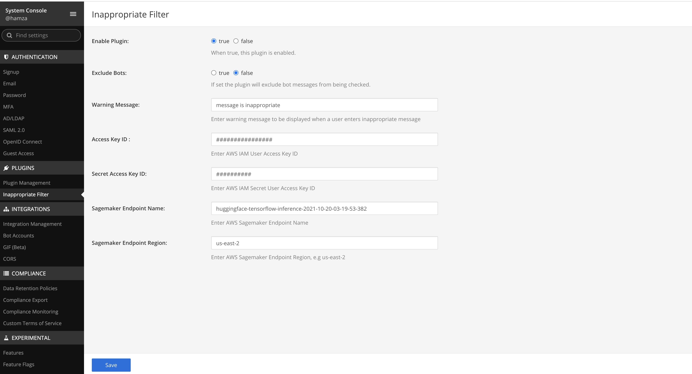

# Mattermost Inappropriate filter Plugin (Beta)

This plugin allows you to censor inappropriate messages on your Mattermost server. The plugin checks all messages a machine learning model before they are posted to any channel. Inappropriate messages are then blocked until user confirms they want to send them.

**Supported Mattermost Server Versions: 5.2+**

## Plugin Marketplace

1. Go to **Main Menu -> Plugin Marketplace** in Mattermost.
2. Search for "Inappropriate Filter" or manually find the plugin from the list and click **Install**
3. Once the plugin has downloaded and been installed, click **Configure**.

## Setup with AWS Sagemaker

1. Under Sagemaker console go to Notebook -> Notebook Instances and create a notebooke instance
2. Open the notebook instance and create a new 'conda_tensorflow2_p36' notebook
3. Run the following script in a cell to load and deploy the model:

```python
import sagemaker
sess = sagemaker.Session()
role = sagemaker.get_execution_role()

from sagemaker.huggingface.model import HuggingFaceModel

#Hub Model configuration. <https://huggingface.co/models>
hub = {
  'HF_MODEL_ID':'hamzaMM/hamza-bert', # model_id from hf.co/models
  'HF_TASK':'text-classification' 
}

role = IAM role ARN

#create Hugging Face Model Class
huggingface_model = HuggingFaceModel(
   env=hub, # configuration for loading model from Hub
   role=role, # iam role with permissions to create an Endpoint
   transformers_version="4.6", # transformers version used
   tensorflow_version="2.4", # pytorch version used
   py_version='py37', # python version used
)

#deploy model to SageMaker Inference
predictor = huggingface_model.deploy(
   initial_instance_count=1,
   instance_type="ml.t2.medium" #Change to any instance type
   #Un comment to add elastic inference to speed up prediction latency
   #instance_type="ml.m4.xlarge",  
)

```

After the model model is deployed, it will create a model, endpoint configuration, and endpoint which will serve the model.

To use custom endpoint configuration create a endpoint using the sagemaker console, and add paramter endpoint_name with the deploy method.
More information available here: https://sagemaker.readthedocs.io/en/stable/api/inference/model.html

Once the endpoint is serving you may close and stop the notebook instance.

## Setup with local server

Coming Soon

## Configuration in Mattermost webapp


Get Access Key from IAM -> Users -> Security Credentials -> Create Access Key

Get Endpoint Name from Sagemaker Console -> Inference -> Endpoint  

Get region from Sagemaker Console -> Inference -> Models -> My_Model  


### Usage

You can edit the bad words list in **System Console > Plugins > Inappropriate Filter**.


