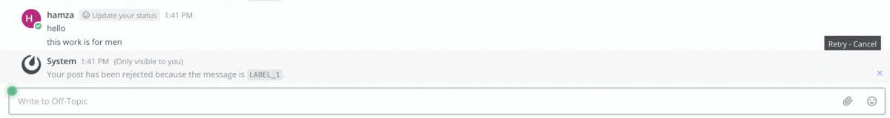

# Mattermost Inappropriate filter Plugin (Beta)

This plugin allows you to censor inappropriate messages on your Mattermost server. The plugin checks all messages a machine learning model before they are posted to any channel. Inappropriate messages are then blocked until user confirms they want to send them.

**Supported Mattermost Server Versions: 5.2+**

## Plugin Marketplace

1. Go to **Main Menu > Plugin Marketplace** in Mattermost.
2. Search for "Inappropriate Filter" or manually find the plugin from the list and click **Install**
3. Once the plugin has downloaded and been installed, click **Configure**.

## Manual Installation

### Usage

You can edit the bad words list in **System Console > Plugins > Inappropriate Filter**.

